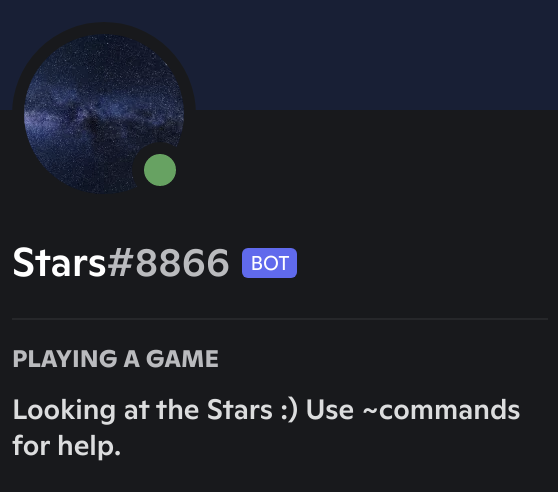

# Stars Bot
This is a discord bot in the python language that uses NASA's API's, of which you can browse using [api.nasa.gov](https://api.nasa.gov/).

The API's and libraries used in this project include but are not limited to:
1. Discord.py
2. APOD API
3. NeoWs API
4. EARTH API
5. EPIC API
6. Mars Rover Photos API by Chris Cerami
7. Nasa Image and Video Library API

If you want to invite this bot to your server use the following [link](https://discord.com/api/oauth2/authorize?client_id=894305631966756935&permissions=274877933568&scope=bot).

## Functionality of the bot
    Note: Keep in mind that this bot is still in development, and is a pet project of mine so I wont be spending that much time developing it.

The default prefix for this bot is `~`. 
1. Command: `picofday` which uses NASA's APOD API to return the Curated Astronomy Picture of the Day alongside a description for it.
2. Command: `neos [ (default=0) page_num] [ (default=1) neos_count]` which returns the x amount of Near Earth Objects stored in the Near Earth Objects Web Service of which all the data is supplied by the [NASA JPL Asteroid Team](http://neo.jpl.nasa.gov/) from the page number supplied.
3. Command: `earth [longitude] [latitude]` which returns a LandSat image of earth from the Joint project between NASA and USGS. This returns a Google Earth Engine Link to view the LandSat Images. (*Note: This feature is really buggy and needs some work. Some lon lat combinations seem to not return any values by the API.*)
4. Command: `epic` which returns the latest natural color image of earth using the EPIC API which uses data collected by DSCOVR's Earth Polychromatic Imaging Camera. This provides a unique full disc image of the earth.
5. Command: `mars [rover_num] [sol] [number_of_images] [ (optional) camera_type]` which returns mars rover photos from any of the following 3 mars rovers:  1. Curiosity  2. Opportunity  3. Spirit. Photos are organized by the sol (Martian rotation or day) on which they were taken, counting up from the rover's landing date. The API accesses photos taken directly by these 3 rovers. Thank you to **Chris Cerami** for this API.
6. Command: `nasalib [ (default="orion") search] [ (default=5) num]` which returns a number of results from a search query made to the NASA Image and Video Library at [images.nasa.gov](https://images.nasa.gov/#/). This returns the supplied number of entries for that search result back to the user.
7. **MORE FUNCTIONALITY COMING SOON!!**

### Some information

If you feel like supporting it at all please raise any issues or improvements for the bot in the [issue tracker](https://github.com/notd5a-alt/stars-bot/issues/).
I hope you enjoy using this bot :)